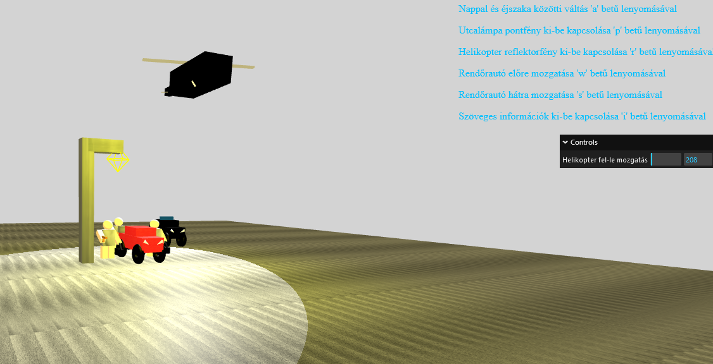

# BabyDriver3D

The start of the intro scene from the Baby Driver move made in **THREE.js**.



## Getting Started

### Prerequisites

- If you'd like to run the project without an IDE have **Node.js** installed on your machine.

### Running the Project in WebStorm

1. Clone the repository:
    ```bash
    git clone https://github.com/Ricsvagyok20/BabyDriver3D.git
    cd BabyDriver3D
    ```
2. Open the project in WebStorm.
3. Run the project by clicking on one of the browser options in the top-right corner.

### Running the Project without WebStorm

1. Clone the repository:
    ```bash
    git clone https://github.com/Ricsvagyok20/BabyDriver3D.git
    cd BabyDriver3D
    ```
2. Install a simple HTTP server (e.g., `http-server`):
    ```bash
    npm install -g http-server
    ```
3. Start the server in the project directory:
    ```bash
    http-server
    ```
4. Open your browser and navigate to `http://localhost:8080`.

## Project Structure

- `assets/`: Contains textures and other assets.
- `dist/`: Contains the distribution files.
- `js-r154/`: Contains the THREE.js library files.
- `BabyDriverIntro.html`: Main HTML file to load the game.
